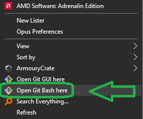
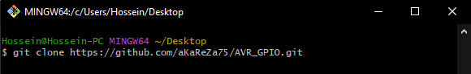
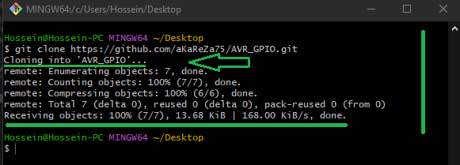
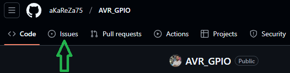
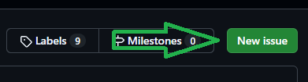
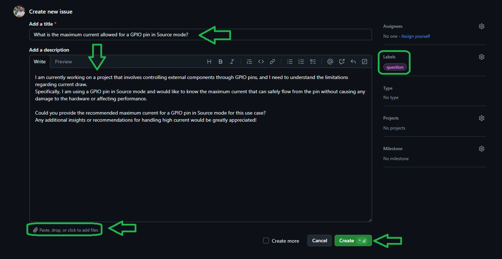

# GPIO (General Purpose Input/Output)

The General Purpose Input/Output (GPIO) peripheral is a fundamental feature in microcontrollers like the AVR series. It allows the microcontroller to interact with external devices such as LEDs, switches, sensors, and more. GPIO pins can be configured as either inputs or outputs, and their states can be read or written using specific registers. These pins offer a versatile way to communicate with the outside world, enabling a wide range of applications in embedded systems.

> [!NOTE]
> The content here is updated regularly to include new presentations as they are created.

## GPIO Registers

In AVR microcontrollers, GPIO functionality is controlled through several registers:

### 1. **DDRx (Data Direction Register)**

The DDRx register controls the direction of the GPIO pins. Each bit corresponds to a specific pin, and setting a bit to `1` configures the corresponding pin as an output. Setting the bit to `0` configures it as an input.

| Bit  | Pin | Description |
|------|-----|-------------|
| 0    | PD0 | 1 = Output, 0 = Input |
| 1    | PD1 | 1 = Output, 0 = Input |
| 2    | PD2 | 1 = Output, 0 = Input |
| 3    | PD3 | 1 = Output, 0 = Input |
| 4    | PD4 | 1 = Output, 0 = Input |
| 5    | PD5 | 1 = Output, 0 = Input |
| 6    | PD6 | 1 = Output, 0 = Input |
| 7    | PD7 | 1 = Output, 0 = Input |

### 2. **PORTx (Data Register)**

The PORTx register controls the output state of pins configured as outputs. Writing a `1` to a bit sets the corresponding pin to a high voltage level, while writing a `0` sets the pin to a low voltage level.

| Bit  | Pin | Description |
|------|-----|-------------|
| 0    | PD0 | 1 = High, 0 = Low |
| 1    | PD1 | 1 = High, 0 = Low |
| 2    | PD2 | 1 = High, 0 = Low |
| 3    | PD3 | 1 = High, 0 = Low |
| 4    | PD4 | 1 = High, 0 = Low |
| 5    | PD5 | 1 = High, 0 = Low |
| 6    | PD6 | 1 = High, 0 = Low |
| 7    | PD7 | 1 = High, 0 = Low |

### 3. **PINx (Input Pins Address)**

The PINx register reads the current state of pins configured as inputs. If a bit is set to `1`, the corresponding pin is at a high voltage level. If the bit is `0`, the pin is at a low voltage level.

| Bit  | Pin | Description |
|------|-----|-------------|
| 0    | PD0 | 1 = High, 0 = Low |
| 1    | PD1 | 1 = High, 0 = Low |
| 2    | PD2 | 1 = High, 0 = Low |
| 3    | PD3 | 1 = High, 0 = Low |
| 4    | PD4 | 1 = High, 0 = Low |
| 5    | PD5 | 1 = High, 0 = Low |
| 6    | PD6 | 1 = High, 0 = Low |
| 7    | PD7 | 1 = High, 0 = Low |

## Example Code
> [!NOTE]  
> The macros used in the code below are all defined in the `aKaReZa.h` header file, and detailed descriptions of these macros can be found at the following link:  
> [https://github.com/aKaReZa75/AVR/blob/main/Macros.md](https://github.com/aKaReZa75/AVR/blob/main/Macros.md)

```c
#include "aKaReZa.h"

/* Configure PD0 as output and PD1 as input */
bitSet(DDRD, 0);  // Set PD0 as output
bitClear(DDRD, 1); // Set PD1 as input

/* Set PD0 to high */
bitSet(PORTD, 0);  // Set PD0 high

/* Check if the bit 1 of PIND is high */
if (bitCheck(PIND, 1)) 
{
    bitWaitLow(PIND, 1); /**< Wait until bit 1 of PIND goes low */
    bitToggle(PORTD, 0); /**< Toggle the bit 0 of PORTD (change the state of pin 0 of PORTD) */
}
```

## Additional Notes and Common Pitfalls

1. **Input Configuration**: 
   When configuring a pin as an input, ensure that the corresponding bit in the `DDRx` register is set to `0`. If you accidentally set the pin to output and try to read from it, the value returned will not reflect the actual pin state.

2. **Internal Pull-Up Resistor**: 
   If you need to use a pin as an input and you want to avoid floating states, you can enable the internal pull-up resistor by writing a `1` to the corresponding bit in the `PORTx` register. This is useful when no external resistor is connected to the input pin.

   ```c
   /* Enable internal pull-up resistor on PD1 */
   bitSet(PORTD, 1);  // Enable pull-up on PD1
   ```

3. **Avoid Writing to Input Pins**: 
   Writing to a pin configured as input will have no effect, but it may cause confusion if you mistakenly attempt to do so. Ensure that you only write to pins configured as outputs.

4. **Debouncing Buttons**: 
   When reading inputs from mechanical switches, be aware of button bounce. Consider adding a delay or implementing a software debouncing mechanism to ensure accurate reading of the button state.

5. **PINx for Input Only**: 
   The `PINx` register should only be used to read the state of input pins. Reading from output pins with `PINx` may give incorrect results as it returns the last value written to the `PORTx` register.

6. **Port Pin Conflict**: 
   Be mindful of pins that may serve multiple purposes (e.g., a pin that is both an SPI pin and a regular GPIO). Check the datasheet to ensure proper pin configuration to avoid conflicts between functions.

# 💻 How to Use Git and GitHub
To access the repository files and save them on your computer, there are two methods available:
1. **Using Git Bash and Cloning the Repository**
   - This method is more suitable for advanced users and those familiar with command-line tools.
   - By using this method, you can easily receive updates for the repository.

2. **Downloading the Repository as a ZIP file**
   - This method is simpler and suitable for users who are not comfortable with command-line tools.
   - Note that with this method, you will not automatically receive updates for the repository and will need to manually download any new updates.

## Clone using the URL.
First, open **Git Bash** :
-  Open the folder in **File Explorer** where you want the library to be stored.
-  **Right-click** inside the folder and select the option **"Open Git Bash here"** to open **Git Bash** in that directory.



> [!NOTE] 
> If you do not see the "Open Git Bash here" option, it means that Git is not installed on your system.  
> You can download and install Git from [this link](https://git-scm.com/downloads).  
> For a tutorial on how to install and use Git, check out [this video](https://youtu.be/BsykgHpmUt8).
  
-  Once **Git Bash** is open, run the following command to clone the repository:

 ```bash
git clone https://github.com/aKaReZa75/AVR_GPIO.git
```
- You can copy the above command by either:
- Clicking on the **Copy** button on the right of the command.
- Or select the command text manually and press **Ctrl + C** to copy.
- To paste the command into your **Git Bash** terminal, use **Shift + Insert**.



- Then, press Enter to start the cloning operation and wait for the success message to appear.



> [!IMPORTANT]
> Please keep in mind that the numbers displayed in the image might vary when you perform the same actions.  
> This is because repositories are continuously being updated and expanded. Nevertheless, the overall process remains unchanged.

> [!NOTE]
> Advantage of Cloning the Repository:  
> - **Receiving Updates:** By cloning the repository, you can easily and automatically receive new updates.  
> - **Version Control:** Using Git allows you to track changes and revert to previous versions.  
> - **Team Collaboration:** If you are working on a project with a team, you can easily sync changes from team members and collaborate more efficiently.  

## Download Zip
If you prefer not to use Git Bash or the command line, you can download the repository directly from GitHub as a ZIP file.  
Follow these steps:  
1. Navigate to the GitHub repository page and Locate the Code button:
   - On the main page of the repository, you will see a green Code button near the top right corner.

2. Download the repository:
   - Click the Code button to open a dropdown menu.
   - Select Download ZIP from the menu.

    

3. Save the ZIP file:
   - Choose a location on your computer to save the ZIP file and click Save.

4. Extract the ZIP file:
   - Navigate to the folder where you saved the ZIP file.
   - Right-click on the ZIP file and select Extract All... (Windows) or use your preferred extraction tool.
   - Choose a destination folder and extract the contents.

5. Access the repository:
   - Once extracted, you can access the repository files in the destination folder.

> [!IMPORTANT]
> - No Updates: Keep in mind that downloading the repository as a ZIP file does not allow you to receive updates.    
>   If the repository is updated, you will need to download it again manually.  
> - Ease of Use: This method is simpler and suitable for users who are not comfortable with Git or command-line tools.

# 📝 How to Ask Questions
If you have any questions or issues, you can raise them through the **"Issues"** section of this repository. Here's how you can do it:  

1. Navigate to the **"Issues"** tab at the top of the repository page.  

  

2. Click on the **"New Issue"** button.  
   
  

3. In the **Title** field, write a short summary of your issue or question.  

4. In the "Description" field, detail your question or issue as thoroughly as possible. You can use text formatting, attach files, and assign the issue to someone if needed. You can also use text formatting (like bullet points or code snippets) for better readability.  

5. Optionally, you can add **labels**, **type**, **projects**, or **milestones** to your issue for better categorization.  

6. Click on the **"Submit new issue"** button to post your question or issue.
   
  

I will review and respond to your issue as soon as possible. Your participation helps improve the repository for everyone!  

> [!TIP]
> - Before creating a new issue, please check the **"Closed"** section to see if your question has already been answered.  
>     
> - Write your question clearly and respectfully to ensure a faster and better response.  
> - While the examples provided above are in English, feel free to ask your questions in **Persian (فارسی)** as well.  
> - There is no difference in how they will be handled!  

> [!NOTE]
> Pages and interfaces may change over time, but the steps to create an issue generally remain the same.

# 🤝 Contributing to the Repository
To contribute to this repository, please follow these steps:
1. **Fork the Repository**  
2. **Clone the Forked Repository**  
3. **Create a New Branch**  
4. **Make Your Changes**  
5. **Commit Your Changes**  
6. **Push Your Changes to Your Forked Repository**  
7. **Submit a Pull Request (PR)**  

> [!NOTE]
> Please ensure your pull request includes a clear description of the changes you’ve made.
> Once submitted, I will review your contribution and provide feedback if necessary.

# 🌟 Support Me
If you found this repository useful:
- Subscribe to my [YouTube Channel](https://www.youtube.com/@aKaReZa75).
- Share this repository with others.
- Give this repository and my other repositories a star.
- Follow my [GitHub account](https://github.com/aKaReZa75).

# 📜 License
This project is licensed under the GPL-3.0 License. This license grants you the freedom to use, modify, and distribute the project as long as you:
- Credit the original authors: Give proper attribution to the original creators.
- Disclose source code: If you distribute a modified version, you must make the source code available under the same GPL license.
- Maintain the same license: When you distribute derivative works, they must be licensed under the GPL-3.0 too.
- Feel free to use it in your projects, but make sure to comply with the terms of this license.
  
# ✉️ Contact Me
Feel free to reach out to me through any of the following platforms:
- 📧 [Email: aKaReZa75@gmail.com](mailto:aKaReZa75@gmail.com)
- 🎥 [YouTube: @aKaReZa75](https://www.youtube.com/@aKaReZa75)
- 💼 [LinkedIn: @akareza75](https://www.linkedin.com/in/akareza75)
